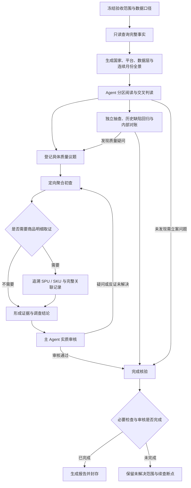

# monthly-acceptance

**月度大盘数据验收 Skill · 0.0.1**

从宏观全景出发，识别真正影响大盘可信度的质量问题，再按需追溯到商品明细，以可复核的证据形成验收结论。

## 架构设计

采用「完整事实 → 全景判读 → 议题调查 → 独立审核」的执行流程。程序保证范围、计算与证据可核验，Agent 负责理解数据、提出质量疑问并判断业务影响。



### 核心原则

- **宏观先行**：先检查国家、平台、月份与数据层，再阅读完整类目分区及正负贡献，最后深入商品明细。
- **以问题组织调查**：同一事件的跨月、跨类目证据集中分析；机器信号、查询分片和样本不直接等同于深查任务。
- **证据决定是否继续**：质量疑问或重大反证尚未解决就继续调查。实际缺证和资源不足分别记录，保留恢复条件与断点。
- **审核必须实质进行**：主审检查原始证据、计算和竞争解释；重大正常判断、历史回归和冲突还需未参与调查者独立复核。
- **结论可复核**：冻结范围、脚本和政策，保留查询来源、分页、证据定位及审核记录；封存前重新核验完成条件。

## 审计重点

| 维度 | 关注的问题 |
| --- | --- |
| 完整性 | 国家、平台、月份、类目或数据层缺失；整月断档；应有 raw/std 承接未出现 |
| 重复与放大 | 源记录多次映射，SKU/SPU 重计，join 或映射关系放大量额 |
| 身份连续性 | 父体、SKU 或平台异常跳变，空值与占位 SKU 错联，不同商品被合并 |
| 数值守恒 | raw/std、父层与叶级汇总不一致，正负贡献异常抵消 |
| 时间序列 | 整类断崖或恢复、价格数量级跳变、月份回写与跨月属性漂移 |
| 价格带 | 单位或币种错误、重复跨带、未知价格与空分母处理错误 |
| 历史缺陷回归 | 已知数据缺陷再次出现，修复是否覆盖底层映射与相关月份 |

类目打标与映射语义不作为默认专项。局部问题只有在规模、销量、价格带、趋势或共同机制上造成值得关注的影响时，才在报告正文单列；其余必要观察放入辅助内容。

## 交付内容

报告先呈现整体覆盖与验收状态，再展开重点质量问题，分别列明：

- 已证实缺陷及其影响范围、量额和证据。
- 已完成核查的范围与结论依据。
- 尚未解决的风险、外部缺证和后续核查条件。

查询执行、全景阅读、议题调查和审核进度分别披露。没有立案议题时，仍须完成必要的覆盖检查、抽查与回归核验。

## 使用

1. 将 `.claude/skills/monthly-acceptance` 安装到目标项目；本仓库中的 `.agents/skills/monthly-acceptance` 为指向同一 Skill 的相对软链接。
2. 按 [Skill 入口](.claude/skills/monthly-acceptance/SKILL.md) 准备 `验收/config.yaml`、`项目范围.md`、数据月和可用契约。
3. 配置只读 Doris MCP，由 Agent 按 Skill 执行验收。

执行环境：Python 3.11+、支持文件锁的 macOS/Linux、PyYAML 与 MCP Python SDK。数据库表和字段须符合执行协议。Doris MCP 默认读取本机 `~/.codex/config.toml` 的 `mcp_servers.doris`，也可通过 CLI 指定配置文件。

```sh
python3 -m pip install -r requirements.txt
```

仓库包含 Skill 源码、测试与使用资料。项目数据、运行证据与数据库凭据由使用项目和本机环境管理。

## 文档与验证

- [Skill 入口与执行步骤](.claude/skills/monthly-acceptance/SKILL.md)
- [全景、议题与审核协议](.claude/skills/monthly-acceptance/references/question-workflow.md)
- [数据口径与方法说明](.claude/skills/monthly-acceptance/references/methodology.md)
- [报告写作规范](.claude/skills/monthly-acceptance/references/report-writing.md)

当前工程测试：**764 项通过**。

```sh
PYTHONDONTWRITEBYTECODE=1 python3 -m pytest -q -p no:cacheprovider .claude/skills/monthly-acceptance/tests
```
